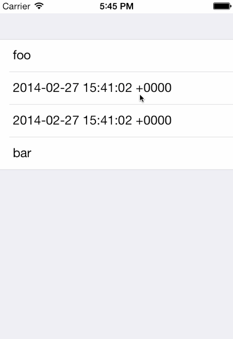

 &nbsp; 
 &nbsp; 


DTInlineDatePicker
===================

> This is a project-extension for [DTTableViewManager](https://github.com/DenHeadless/DTTableViewManager) and [DTPickerPresenter](https://github.com/DenHeadless/DTPickerPresenter).



Starting with iOS 7, Apple encourages developers to present UIDatePickers in UITableView inline.  Without any wrappers, this might take quite a bit of code to do. In fact, [Apple's own example](https://developer.apple.com/library/ios/samplecode/datecell/Introduction/Intro.html) is about 450 lines of code. DTInlineDatePicker provides much easier way to do that.

Presenting UIDatePicker now can be just three lines of code:

```objective-c
NSIndexPath * indexPath = [NSIndexPath indexPathForRow:1 inSection:0];
DTDatePickerPresenter * presenter = [DTDatePickerPresenter presenterWithChangeBlock:^(NSDate * selectedDate)
{
   // Update your model with NSDate     
}];
    
[self attachInlinePickerPresenter:presenter toIndexPath:indexPath];
```

### How to

In order to use DTInlineDatePicker classes, your table view controller needs to be subclassed from `DTInlinePickerTableController`. And you need to be using [DTTableViewManager]((https://github.com/DenHeadless/DTTableViewManager)) API to present your data models. Which you should try out, it is very nice =)

### Responding to cell selection

Sometimes you'll want to react, when cell with date picker is selected. For example, add color to selected cell. DTInlineDatePicker provides two methods to do that:

```objective-c
- (void)didShowPickerForIndexPath:(NSIndexPath *)indexPath;
- (void)didHidePickerForIndexPath:(NSIndexPath *)indexPath;
```

### Example project

To install dependencies for Example project, you need to be using [CocoaPods](http://www.cocoapods.org). Clone the project and run

```shell
pod install
```
in project directory.

### Requirements

* iOS 7
* ARC

### Installation

Install using Cocoapods,

    pod 'DTInlineDatePicker', '~> 0.1'

